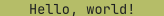
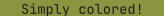

# `simply_colored`

This crate is the simplest yet ergonomic way to add color to your terminal:

```rs
use simply_colored::*;

println!("\
{GREEN}green!
{BLUE}{BOLD}bold blue!
{UNDERLINE}{BOLD}{STRIKETHROUGH}{RED}{ITALIC}and this has a bunch of effects!{OFF}
")
```

## Foreground

| Color                                                  | Type                                   | To get                                                                                                               |
| -----                                                  | ------------------                     | -------                                                                                                              |
|                 | `{GREEN}Hello, world!`                 |                                                      |
|               | `{YELLOW}Hello, world!`                |                                                    |
|                     | `{RED}Hello, world!`                   |                                                          |
|             | `{MAGENTA}Hello, world!`               |                                                  |
|                   | `{BLUE}Hello, world!`                  |                                                        |
|                   | `{CYAN}Hello, world!`                  |                                                        |
|                 | `{WHITE}Hello, world!`                 |                                                      |
|                 | `{BLACK}Hello, world!`                 |                                                      |
|         | `{DIM_GREEN}Hello, world!`             |                                              |
|       | `{DIM_YELLOW}Hello, world!`            |                                            |
|             | `{DIM_RED}Hello, world!`               |                                                  |
|     | `{DIM_MAGENTA}Hello, world!`           |                                          |
|           | `{DIM_BLUE}Hello, world!`              |                                                |
|           | `{DIM_CYAN}Hello, world!`              |                                                |
|         | `{DIM_WHITE}Hello, world!`             |                                              |
|         | `{DIM_BLACK}Hello, world!`             |                                              |

## Background

| Color                                                  | Type                                   |  To get                                                                                                              |
| -----                                                  | ------------------                     | -------                                                                                                              |
|                 | `{BG_GREEN}Hello, world!`              |                                                      |
|               | `{BG_YELLOW}Hello, world!`             |                                                    |
|                     | `{BG_RED}Hello, world!`                |                                                          |
|             | `{BG_MAGENTA}Hello, world!`            |                                                  |
|                   | `{BG_BLUE}Hello, world!`               |                                                        |
|                   | `{BG_CYAN}Hello, world!`               |                                                        |
|                 | `{BG_WHITE}Hello, world!`              |                                                      |
|                 | `{BG_BLACK}Hello, world!`              |                                                      |
|         | `{BG_DIM_GREEN}Hello, world!`          |                                              |
|       | `{BG_DIM_YELLOW}Hello, world!`         |                                            |
|             | `{BG_DIM_RED}Hello, world!`            |                                                  |
|     | `{BG_DIM_MAGENTA}Hello, world!`        |                                          |
|           | `{BG_DIM_BLUE}Hello, world!`           |                                                |
|           | `{BG_DIM_CYAN}Hello, world!`           |                                                |
|         | `{BG_DIM_WHITE}Hello, world!`          |                                              |
|         | `{BG_DIM_BLACK}Hello, world!`          |                                              |

## Effects

| Effect | Type                   |
| ------ | -----                  |
| *Italic* | `{DIM}Hello, world!`   |
| **Bold** | `{BOLD}Hello, world!` |
| <u>Underline</u> | `{UNDERLINE}Hello, world!` |
| Blink  | `{BLINK}Hello, world!` |
| Reverse  | `{REVERSE}Hello, world!` |
| <del>Strikethrough</del>  | `{CROSS}Hello, world!` |
| Dim    | `{DIM}Hello, world!`   |
| Hide   | `{HIDE}Hello, world!`  |
| Reset all styles   | `{RESET}Hello, world!`  |

All effects can be prefixed with `NO_` to disable e.g. `NO_BOLD`.
